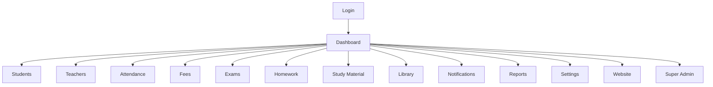
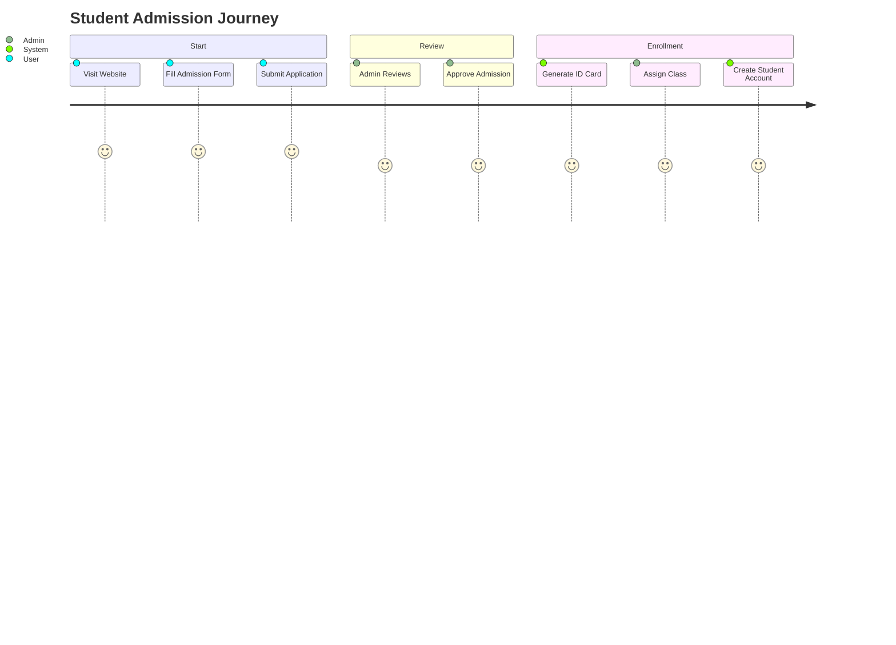

# UI_WIREFRAMES
## Education ERP + Website Wireframe Specification

Document Type: UI/UX Wireframe and Interaction Guide
Version: 1.0
Date: 2026-07-06
Prepared For: Product, Design, Frontend, and Engineering Teams

> This document provides enterprise-grade wireframe guidance for the Education ERP + Website platform. It is intended for designers, product managers, and developers to align on page structure, user flows, responsive behavior, permissions, and interaction expectations.

---

# 1. Design Approach

## 1.1 Product Vision
The UI should feel modern, professional, minimal, and enterprise-ready while remaining simple enough for school staff, teachers, students, and parents to use comfortably.

## 1.2 Core UX Principles
- Clarity over complexity
- Role-based simplification
- Fast workflows for recurring tasks
- Consistent patterns across modules
- Strong accessibility and responsive behavior

## 1.3 Information Architecture
The platform is organized into:
- Auth area
- Core dashboard
- Student management
- Teacher management
- Parent management
- Attendance
- Fees
- Exams
- Homework
- Study materials
- Library
- Notifications
- Reports
- Settings
- Super admin
- Website CMS

---

# 2. Global Navigation Structure

## 2.1 Main Navigation Model
```text
+--------------------------------------------------------------+
| Logo | Search | Notifications | Profile | Theme | Language |
+--------------------------------------------------------------+
| Sidebar Menu                                                 |
| - Dashboard                                                  |
| - Students                                                   |
| - Teachers                                                   |
| - Parents                                                    |
| - Attendance                                                 |
| - Fees                                                       |
| - Exams                                                      |
| - Homework                                                   |
| - Study Material                                             |
| - Library                                                    |
| - Notifications                                              |
| - Reports                                                    |
| - Settings                                                   |
| - Super Admin (if applicable)                                |
| - Website                                                    |
+--------------------------------------------------------------+
```

## 2.2 Navigation Flow Diagram


## 2.3 User Journey Diagram


---

# 3. Authentication Pages

## 3.1 Login
### Purpose
Allow users to authenticate into the ERP or website admin panel.

### User Flow
1. User opens login page.
2. Enters email/username and password.
3. System validates credentials.
4. Redirects to role-based dashboard.

### Layout
```text
+----------------------------------------------+
| Logo                                         |
|                                              |
| Email / Username                             |
| Password                                     |
| [Login]                                      |
| Forgot Password?                             |
| Register / Create Account                    |
+----------------------------------------------+
```

### Components
- Logo header
- Email/username field
- Password field
- Show password toggle
- Login button
- Forgot password link
- Register link
- Remember me checkbox

### Actions
- Login
- Forgot Password
- Create Account

### Responsive Behaviour
- Single-column centered layout on mobile
- Two-column layout on desktop with branding image on one side

### Validation
- Required fields
- Invalid credentials message
- Account lock handling

### Permissions
- Any active user role

### Navigation
- Redirect to dashboard after success

### Future Improvements
- SSO support
- Multi-factor authentication
- Social login

---

## 3.2 Register
### Purpose
Allow new users or institutional administrators to register an account.

### User Flow
1. User enters personal and institutional details.
2. Confirms terms.
3. System validates and creates pending account.
4. Admin or email verification completes activation.

### Layout
```text
+----------------------------------------------+
| Register Account                             |
| Name                                         |
| Email                                        |
| Password                                     |
| Confirm Password                             |
| Institution Name                             |
| Phone                                        |
| [Create Account]                             |
| Already have an account? Login               |
+----------------------------------------------+
```

### Components
- Name, email, phone fields
- Password fields
- Institution dropdown or text box
- Terms checkbox
- Submit button

### Actions
- Register
- Back to login

### Responsive Behaviour
- Single-column stacked form on small devices

### Validation
- Password strength
- Unique email/username
- Required institution details

### Permissions
- Public access

### Navigation
- Redirect to pending verification or login

### Future Improvements
- Invitation-based registration
- OTP verification
- Role selection during signup

---

## 3.3 Forgot Password
### Purpose
Allow users to recover access to their account.

### User Flow
1. User enters registered email.
2. System sends reset link.
3. User opens email and resets password.

### Layout
```text
+----------------------------------------------+
| Forgot Password                              |
| Enter registered email                      |
| [Send Reset Link]                           |
| Back to Login                               |
+----------------------------------------------+
```

### Components
- Email field
- Submit button
- Back link

### Actions
- Send reset link
- Cancel

### Responsive Behaviour
- Simple centered form

### Validation
- Valid email required
- Existing account check

### Permissions
- Public access

### Navigation
- Redirect to success confirmation view

### Future Improvements
- OTP-based reset
- Security questions

---

## 3.4 Reset Password
### Purpose
Allow users to set a new password after verification.

### User Flow
1. User opens reset link.
2. Enters new password.
3. Confirms password.
4. System updates password and logs user in.

### Layout
```text
+----------------------------------------------+
| Reset Password                               |
| New Password                                 |
| Confirm Password                             |
| [Update Password]                            |
+----------------------------------------------+
```

### Components
- Password field
- Confirm password field
- Update button

### Actions
- Submit new password
- Cancel

### Responsive Behaviour
- Simple centered form

### Validation
- Password strength rules
- Password match
- Token validity

### Permissions
- Token-based access

### Navigation
- Redirect to login or dashboard

### Future Improvements
- Password history enforcement
- Biometric recovery options

---

# 4. Dashboard Pages

## 4.1 Admin Dashboard
### Purpose
Provide institutional leadership with a high-level operational and financial overview.

### User Flow
1. Admin enters dashboard.
2. Views KPI cards, charts, notices, and pending actions.
3. Opens modules from quick actions.

### Layout
```text
+--------------------------------------------------------------+
| Header: Search | Notifications | Profile                     |
+--------------------------------------------------------------+
| Sidebar | Main Content                                       |
|         | KPI Cards: Students | Teachers | Fees | Attendance |
|         | Charts: Revenue / Attendance / Admissions         |
|         | Quick Actions: Add Student / Add Fee / Create Exam |
|         | Recent Activities / Alerts / Notifications         |
+--------------------------------------------------------------+
```

### Components
- KPI cards
- Graphs
- Quick action buttons
- Recent activities list
- Notifications panel

### Actions
- View stats
- Jump to modules
- Manage alerts

### Responsive Behaviour
- 2-column cards on desktop
- Single-column stack on mobile

### Validation
- Data freshness checks
- Empty state handling

### Permissions
- Super admin or institution admin

### Navigation
- Sidebar links to all modules

### Future Improvements
- Personalized widgets
- Role-based dashboard customization

---

## 4.2 Teacher Dashboard
### Purpose
Help teachers manage classes, attendance, homework, and student communication.

### Layout
```text
+--------------------------------------------------------------+
| Header                                                       |
+--------------------------------------------------------------+
| Sidebar | Today Overview                                    |
|         | Assigned Classes | Attendance | Homework | Notices |
|         | Upcoming Classes / Pending Reviews                  |
+--------------------------------------------------------------+
```

### Components
- Assigned classes card
- Attendance shortcuts
- Homework queue
- Upcoming schedule

### Actions
- Mark attendance
- Review homework
- View class roster

### Responsive Behaviour
- Compact cards and stacked components

### Validation
- Class assignment verification
- Attendance lock warnings

### Permissions
- Teacher role

### Navigation
- Teacher module links

### Future Improvements
- Calendar-driven workflow
- AI teaching assistant panel

---

## 4.3 Student Dashboard
### Purpose
Provide students with academic, attendance, fee, and assignment overview.

### Layout
```text
+--------------------------------------------------------------+
| Header                                                       |
+--------------------------------------------------------------+
| Sidebar | Overview Cards | Homework | Attendance | Results |
|         | Recent Announcements / Study Material             |
+--------------------------------------------------------------+
```

### Components
- Attendance summary
- Fee status
- Homework list
- Results preview
- Announcements

### Actions
- View timetable
- Download study material
- Submit homework

### Responsive Behaviour
- Mobile-friendly cards and simplified menus

### Validation
- Student account active status

### Permissions
- Student role

### Navigation
- Student-specific modules

### Future Improvements
- Personalized learning insights
- Mobile app parity

---

## 4.4 Parent Dashboard
### Purpose
Allow parents to view student progress, attendance, fees, and announcements.

### Layout
```text
+--------------------------------------------------------------+
| Header                                                       |
+--------------------------------------------------------------+
| Sidebar | Child Summary | Attendance | Fees | Results        |
|         | Recent Notifications / Messages                  |
+--------------------------------------------------------------+
```

### Components
- Child cards
- Attendance summary
- Fee status
- Examination results
- Notifications

### Actions
- View child details
- Pay pending fees
- Read announcements

### Responsive Behaviour
- Streamlined mobile view with one child at a time

### Validation
- Parent-child linking validation

### Permissions
- Parent role

### Navigation
- Parent-related information modules

### Future Improvements
- Family dashboard widgets
- Messaging integration

---

## 4.5 Accountant Dashboard
### Purpose
Support fee collection, receipts, dues, and financial reporting.

### Layout
```text
+--------------------------------------------------------------+
| Header                                                       |
+--------------------------------------------------------------+
| Sidebar | Collection Summary | Due Fees | Receipts | Reports |
|         | Payment Alerts / Pending Reconciliation           |
+--------------------------------------------------------------+
```

### Components
- Financial KPIs
- Payment and dues list
- Receipt shortcuts
- Reconciliation panel

### Actions
- Record payment
- Generate receipt
- Review dues

### Responsive Behaviour
- Compact table-first layout on desktop

### Validation
- Duplicate payment checks
- Receipt uniqueness

### Permissions
- Accountant role

### Navigation
- Finance-related modules

### Future Improvements
- Export to accounting systems

---

## 4.6 Reception Dashboard
### Purpose
Handle admissions, visitor interactions, and front-office tasks.

### Layout
```text
+--------------------------------------------------------------+
| Header                                                       |
+--------------------------------------------------------------+
| Sidebar | Admissions | Today Schedule | Walk-ins | Queries   |
|         | Pending Follow-ups / Quick Actions                |
+--------------------------------------------------------------+
```

### Components
- Admission queue
- Daily tasks
- Follow-up reminders

### Actions
- Create admission
- Update inquiry
- Manage walk-ins

### Responsive Behaviour
- Fast and compact mobile layout

### Validation
- Contact details and admission requirements

### Permissions
- Reception role

### Navigation
- Admissions and contact modules

### Future Improvements
- Visitor management integration

---

# 5. Student Module Pages

## 5.1 Student List
### Purpose
Display and manage all students under an institution.

### Layout
```text
+--------------------------------------------------------------+
| Page Header: Students | Search | Filter | Add Student        |
+--------------------------------------------------------------+
| Table: Name | Class | Section | Status | Actions            |
| Row 1 ...                                                    |
| Row 2 ...                                                    |
| Pagination                                                   |
+--------------------------------------------------------------+
```

### Components
- Search bar
- Filters
- Add button
- Table with actions

### Actions
- Add student
- View student
- Edit student
- Delete/Archive

### Responsive Behaviour
- Table becomes card list on mobile

### Validation
- Duplicate student checks
- Required fields

### Permissions
- Admin, receptionist, principal, teacher (limited)

### Navigation
- Link to student detail and admission pages

### Future Improvements
- Advanced search and saved filters

---

## 5.2 Student Details
### Purpose
Present full academic and personal information about a student.

### Layout
```text
+--------------------------------------------------------------+
| Header: Student Name | Status | Actions                     |
+--------------------------------------------------------------+
| Tabs: Overview | Attendance | Fees | Results | Documents   |
| Overview Panel: Profile Info | Guardian | Class | Session   |
| Related Panels: Documents / Certificates / ID Card        |
+--------------------------------------------------------------+
```

### Components
- Profile header
- Tabs
- Profile summary cards
- Activity feed

### Actions
- Edit profile
- View documents
- Download ID card
- View fee history

### Responsive Behaviour
- Tabs collapse into dropdown on mobile

### Validation
- Student record must be active or pending

### Permissions
- Authorized roles only

### Navigation
- Back to list
- Related module links

### Future Improvements
- Timeline of student lifecycle events

---

## 5.3 Add Student
### Purpose
Capture student admission information.

### Layout
```text
+--------------------------------------------------------------+
| Form Header: Add Student                                    |
| Section 1: Personal Details                                 |
| Section 2: Guardian & Contact                               |
| Section 3: Academic Details                                 |
| Section 4: Documents / Admission Fee                        |
| [Save] [Cancel]                                             |
+--------------------------------------------------------------+
```

### Components
- Stepper or sectioned form
- Input fields
- Dropdowns
- File upload for documents

### Actions
- Save student
- Save and create another
- Cancel

### Responsive Behaviour
- Multi-column on desktop, stacked on mobile

### Validation
- Mandatory fields
- Admission number uniqueness
- Guardian contact validation

### Permissions
- Admin, receptionist, admission role

### Navigation
- Return to student list after save

### Future Improvements
- Smart form prefill and document checklist

---

## 5.4 Edit Student
### Purpose
Modify student profile and linked data.

### Layout
```text
+--------------------------------------------------------------+
| Header: Edit Student                                        |
| Tabs: Profile | Academic | Guardian | Medical | Documents |
| Form fields with save action                                |
+--------------------------------------------------------------+
```

### Components
- Form sections
- Save and discard buttons

### Actions
- Update details
- Upload documents
- Change status

### Responsive Behaviour
- Vertical stacking for mobile

### Validation
- Modify only allowed fields
- Keep history for changes

### Permissions
- Authorized admin or staff

### Navigation
- Return to student detail page

### Future Improvements
- Audited change history panel

---

## 5.5 Documents
### Purpose
Upload and view student-related documents.

### Layout
```text
+--------------------------------------------------------------+
| Header: Documents                                         |
| Upload Button | Search                                     |
| File List: Name | Type | Date | Actions                    |
+--------------------------------------------------------------+
```

### Components
- File list
- Upload modal or drawer
- Document categories

### Actions
- Upload
- Download
- Delete
- Verify

### Responsive Behaviour
- File cards on mobile

### Validation
- Allowed formats
- Maximum size

### Permissions
- Admin, teacher, parent (limited)

### Navigation
- Linked from student detail

### Future Improvements
- Document expiration alerts

---

## 5.6 ID Card
### Purpose
Preview and print student ID cards.

### Layout
```text
+--------------------------------------------------------------+
| Header: ID Card                                            |
| Preview Card | Actions: Print / Download / Email           |
+--------------------------------------------------------------+
```

### Components
- Card preview
- Print and download actions

### Actions
- Download PDF
- Print
- Reissue

### Responsive Behaviour
- Preview scales for mobile

### Validation
- Active student only

### Permissions
- Admin or authorized staff

### Navigation
- Accessible from student detail

### Future Improvements
- Custom templates per institute

---

## 5.7 Certificates
### Purpose
Issue and manage certificates for completed students.

### Layout
```text
+--------------------------------------------------------------+
| Header: Certificates                                      |
| Filter by type | Add Certificate                           |
| Certificate List with status                              |
+--------------------------------------------------------------+
```

### Components
- Certificate list
- Issue button
- Template preview

### Actions
- Issue certificate
- Download PDF
- Void certificate

### Responsive Behaviour
- Card-based list on small screens

### Validation
- Completion or exam criteria must be met

### Permissions
- Admin, academic admin

### Navigation
- From student detail and reports

### Future Improvements
- Signature and seal support

---

# 6. Teacher Module Pages

## 6.1 Teacher List
### Purpose
Manage teaching staff entries.

### Layout
```text
+--------------------------------------------------------------+
| Header: Teachers | Search | Filter | Add Teacher           |
+--------------------------------------------------------------+
| Table: Name | Subject | Class | Status | Actions           |
+--------------------------------------------------------------+
```

### Components
- Search and filter
- Teacher table

### Actions
- Add teacher
- Edit teacher
- View profile

### Responsive Behaviour
- Card-based layout on small screens

### Validation
- Unique teacher ID
- Subject and class validation

### Permissions
- Admin, HR, academic admin

### Navigation
- Teacher profile and attendance pages

### Future Improvements
- Bulk onboarding flow

---

## 6.2 Teacher Profile
### Purpose
Display teacher details and assignments.

### Layout
```text
+--------------------------------------------------------------+
| Header: Teacher Name                                       |
| Tabs: Overview | Subjects | Classes | Documents | Salary |
| Summary + assigned workloads                                |
+--------------------------------------------------------------+
```

### Components
- Teacher summary card
- Assignment lists
- Documents section

### Actions
- Edit profile
- View salary
- View leave history

### Responsive Behaviour
- Stacked sections on mobile

### Validation
- Status-based access rules

### Permissions
- Admin and teacher self-view

### Navigation
- Linked from teacher list

### Future Improvements
- Performance and evaluation module

---

## 6.3 Attendance
### Purpose
Record teacher attendance and leave.

### Layout
```text
+--------------------------------------------------------------+
| Header: Teacher Attendance                                  |
| Calendar / Date picker | Mark Attendance | Filter           |
| Attendance table for staff                                 |
+--------------------------------------------------------------+
```

### Components
- Date picker
- Attendance table
- Status actions

### Actions
- Mark present/absent/leave
- Save summary

### Responsive Behaviour
- Calendar first on desktop, list on mobile

### Validation
- Attendance lock policy

### Permissions
- Admin, teacher, HR

### Navigation
- From teacher profile or attendance module

### Future Improvements
- Biometric or QR-based attendance

---

## 6.4 Salary
### Purpose
View or manage salary records.

### Layout
```text
+--------------------------------------------------------------+
| Header: Salary Management                                   |
| Filter by month | Generate Salary | Export                 |
| Salary list with deduction summary                         |
+--------------------------------------------------------------+
```

### Components
- Payroll summary
- Salary list
- Export actions

### Actions
- Generate salary
- View slip
- Approve payroll

### Responsive Behaviour
- Data table with card summary on mobile

### Validation
- Approved attendance required

### Permissions
- Admin, accountant

### Navigation
- From teacher profile

### Future Improvements
- Payslip templates and payroll integration

---

## 6.5 Leave
### Purpose
Handle leave requests and approvals.

### Layout
```text
+--------------------------------------------------------------+
| Header: Leave Requests                                      |
| Tabs: My Leave | Approvals | Calendar                      |
| Leave list with status                                     |
+--------------------------------------------------------------+
```

### Components
- Leave request form
- Approval queue
- Calendar view

### Actions
- Apply leave
- Approve or reject leave

### Responsive Behaviour
- Calendar collapses on mobile

### Validation
- Leave dates and policy checks

### Permissions
- Teacher, admin, HR

### Navigation
- Teacher dashboard and profile

### Future Improvements
- Automated leave balance tracking

---

# 7. Parent Module Pages

## 7.1 Parent List
### Purpose
Manage parent accounts and school-parent relationships.

### Layout
```text
+--------------------------------------------------------------+
| Parent List | Search | Filter | Add Parent                  |
+--------------------------------------------------------------+
| Table: Parent Name | Children | Contact | Status            |
+--------------------------------------------------------------+
```

### Components
- Search and filters
- Parent table

### Actions
- Add parent
- Edit parent
- View relation

### Responsive Behaviour
- Card list on mobile

### Validation
- Contact detail validation
- Parent-child association rules

### Permissions
- Admin and reception

### Navigation
- Parent detail page

### Future Improvements
- Parent portal onboarding

---

## 7.2 Parent Details
### Purpose
Show connected students, contact details, and communication settings.

### Layout
```text
+--------------------------------------------------------------+
| Header: Parent Name                                         |
| Tabs: Overview | Children | Messages | Preferences         |
| Parent summary and child cards                             |
+--------------------------------------------------------------+
```

### Components
- Parent profile summary
- Linked children cards
- Notification preferences

### Actions
- Edit profile
- View child records
- Manage communication settings

### Responsive Behaviour
- Tab menu collapses to dropdown

### Validation
- Parent-child relationship check

### Permissions
- Parent self-view and admin

### Navigation
- From parent list

### Future Improvements
- Messaging and reminders center

---

# 8. Attendance Pages

## 8.1 Daily Attendance
### Purpose
Mark daily attendance for students and staff.

### Layout
```text
+--------------------------------------------------------------+
| Header: Daily Attendance                                    |
| Date | Class | Section | Mark All | Save                    |
| Student list with present/absent/late buttons              |
+--------------------------------------------------------------+
```

### Components
- Date picker
- Class filter
- Student list table
- Bulk actions

### Actions
- Mark present/absent/late
- Save attendance
- Bulk update

### Responsive Behaviour
- Two-column on desktop, stacked on mobile

### Validation
- Attendance lock and holiday rules

### Permissions
- Admin, teacher, reception

### Navigation
- From dashboard or attendance module

### Future Improvements
- Mobile attendance app mode

---

## 8.2 Monthly Attendance
### Purpose
View monthly attendance trends and summaries.

### Layout
```text
+--------------------------------------------------------------+
| Header: Monthly Attendance                                  |
| Month Selector | Class Filter | Export                      |
| Summary chart + student table                              |
+--------------------------------------------------------------+
```

### Components
- Summary chart
- Student attendance table

### Actions
- View trend
- Export report

### Responsive Behaviour
- Cards and charts stack on small screens

### Validation
- Approved attendance only

### Permissions
- Admin, teacher, principal

### Navigation
- From reports and dashboard

### Future Improvements
- Predictive trend insights

---

## 8.3 Reports
### Purpose
Display attendance reports and anomalies.

### Layout
```text
+--------------------------------------------------------------+
| Header: Attendance Reports                                  |
| Filters: Class / Date / Student | Generate                 |
| Report table + chart                                       |
+--------------------------------------------------------------+
```

### Components
- Report filters
- Summary chart
- Detailed table

### Actions
- Export PDF/XLS
- Print

### Responsive Behaviour
- Table scroll on smaller screens

### Validation
- Report data scope restrictions

### Permissions
- Admin, principal, teacher (limited)

### Navigation
- From reports module

### Future Improvements
- Attendance anomaly detection visualization

---

# 9. Fee Pages

## 9.1 Fee Dashboard
### Purpose
Show fee collection performance and outstanding balances.

### Layout
```text
+--------------------------------------------------------------+
| Header: Fee Dashboard                                       |
| KPI Cards: Collected / Pending / Due / Discounted           |
| Charts + recent payment activity                            |
+--------------------------------------------------------------+
```

### Components
- KPI cards
- Charts
- Fee alerts

### Actions
- View fee summary
- Open collection flow

### Responsive Behaviour
- Grid stack on mobile

### Validation
- Fee plan linkage

### Permissions
- Accountant and admin

### Navigation
- Finance section

### Future Improvements
- Advanced forecasting

---

## 9.2 Fee Collection
### Purpose
Collect student fee payments and log transaction details.

### Layout
```text
+--------------------------------------------------------------+
| Header: Fee Collection                                      |
| Student Search | Fee Structure | Payment Method | Amount     |
| Payment summary and receipt preview                        |
+--------------------------------------------------------------+
```

### Components
- Student search
- Invoice summary
- Payment form
- Receipt preview

### Actions
- Record cash/online payment
- Generate receipt

### Responsive Behaviour
- Full-width form stack on mobile

### Validation
- Duplicate payment prevention
- Valid invoice and amount

### Permissions
- Accountant and admin

### Navigation
- From fee dashboard or student profile

### Future Improvements
- QR and UPI payment UX

---

## 9.3 Receipts
### Purpose
Display issued receipts and payment history.

### Layout
```text
+--------------------------------------------------------------+
| Header: Receipts                                            |
| Search / Date Filter | Export                               |
| Receipt list with status and actions                       |
+--------------------------------------------------------------+
```

### Components
- Receipt list
- Search and filters
- Export buttons

### Actions
- View receipt
- Print receipt
- Reissue receipt

### Responsive Behaviour
- List to card transition on mobile

### Validation
- Unique receipt number

### Permissions
- Accountant and admin

### Navigation
- From fee collection and reports

### Future Improvements
- Email receipt templates

---

## 9.4 Invoices
### Purpose
Show invoices and outstanding balances.

### Layout
```text
+--------------------------------------------------------------+
| Header: Invoices                                            |
| Filter by student / status | Generate Invoice              |
| Invoice list table                                          |
+--------------------------------------------------------------+
```

### Components
- Invoice table
- Action buttons
- Summary panel

### Actions
- View invoice
- Send invoice
- Apply discount or scholarship

### Responsive Behaviour
- Scrollable table on mobile

### Validation
- Invoice amount and due date rules

### Permissions
- Accountant and admin

### Navigation
- Student fee section and reports

### Future Improvements
- Invoice automation and reminders

---

# 10. Examination Pages

## 10.1 Exam List
### Purpose
Create and manage exams.

### Layout
```text
+--------------------------------------------------------------+
| Header: Exams | Add Exam | Filter                           |
+--------------------------------------------------------------+
| Exam table with date, class, subject, status               |
+--------------------------------------------------------------+
```

### Components
- Table list
- Filter bar
- Create action

### Actions
- Create exam
- Edit exam
- Publish schedule

### Responsive Behaviour
- List cards on mobile

### Validation
- No overlapping classroom schedules

### Permissions
- Academic admin and teacher

### Navigation
- Exam details and result pages

### Future Improvements
- Exam calendar view

---

## 10.2 Question Bank
### Purpose
Store and manage reusable exam questions.

### Layout
```text
+--------------------------------------------------------------+
| Header: Question Bank                                       |
| Filters: Subject / Difficulty / Type | Add Question       |
| Question list with edit actions                             |
+--------------------------------------------------------------+
```

### Components
- Question list
- Filter controls
- Add question button

### Actions
- Add question
- Edit question
- Delete or archive

### Responsive Behaviour
- Card layout on mobile

### Validation
- Question format and marks validation

### Permissions
- Academic admin and teacher

### Navigation
- From exam module

### Future Improvements
- AI-assisted question generation

---

## 10.3 Marks Entry
### Purpose
Enter marks for students in an exam.

### Layout
```text
+--------------------------------------------------------------+
| Header: Marks Entry                                         |
| Exam Info | Class Filter | Save Changes                     |
| Student marks grid                                          |
+--------------------------------------------------------------+
```

### Components
- Grid table
- Numeric input cells
- Save button

### Actions
- Enter marks
- Save and finalize

### Responsive Behaviour
- Horizontal scroll if needed

### Validation
- Marks range and lock rules

### Permissions
- Teacher and academic admin

### Navigation
- From exam detail

### Future Improvements
- Bulk import marks workflow

---

## 10.4 Results
### Purpose
View and publish exam results.

### Layout
```text
+--------------------------------------------------------------+
| Header: Results                                             |
| Filters: Exam / Class / Student | Publish Results         |
| Results table with grade and status                        |
+--------------------------------------------------------------+
```

### Components
- Result table
- Publish action
- Grade summary

### Actions
- Publish results
- Recalculate grade
- Download report

### Responsive Behaviour
- Table with stacked rows on mobile

### Validation
- Finalized marks prior to publish

### Permissions
- Academic admin and teacher

### Navigation
- From exams and reports

### Future Improvements
- Visual performance analytics

---

## 10.5 Report Card
### Purpose
Generate and view report cards.

### Layout
```text
+--------------------------------------------------------------+
| Header: Report Card                                         |
| Student Select | Term Select | Print / Download            |
| Summary report card preview                                |
+--------------------------------------------------------------+
```

### Components
- Student and term selector
- Preview panel
- Print/download actions

### Actions
- Generate report card
- Download PDF

### Responsive Behaviour
- Preview scales down for mobile

### Validation
- Finalized results only

### Permissions
- Academic admin and principal

### Navigation
- Student and exam modules

### Future Improvements
- Custom school templates

---

# 11. Homework Pages

## 11.1 Homework List
### Purpose
Display current and past homework assignments.

### Layout
```text
+--------------------------------------------------------------+
| Header: Homework                                           |
| Filters: Class / Subject / Date | Add Homework             |
| Homework list table                                        |
+--------------------------------------------------------------+
```

### Components
- Assignment list
- Filter bar
- Add action

### Actions
- Create homework
- Edit homework
- View submissions

### Responsive Behaviour
- Stack cards on mobile

### Validation
- Valid subject/class assignment

### Permissions
- Teacher and admin

### Navigation
- To submissions and evaluation

### Future Improvements
- Calendar and reminders

---

## 11.2 Assignment Submission
### Purpose
Allow students to submit homework.

### Layout
```text
+--------------------------------------------------------------+
| Header: Submit Assignment                                   |
| Task details | Upload file | Notes | Submit                |
+--------------------------------------------------------------+
```

### Components
- Assignment detail panel
- File upload
- Notes input
- Submit button

### Actions
- Submit assignment
- Save draft

### Responsive Behaviour
- Form stacks vertically on mobile

### Validation
- Deadline and file type validation

### Permissions
- Student role

### Navigation
- Student dashboard and homework module

### Future Improvements
- Inline editor and version history

---

## 11.3 Evaluation
### Purpose
Enable teachers to evaluate homework submissions.

### Layout
```text
+--------------------------------------------------------------+
| Header: Evaluate Submissions                                |
| Student list | Score | Remarks | Save                       |
+--------------------------------------------------------------+
```

### Components
- Student submission list
- Score fields
- Remarks field

### Actions
- Evaluate
- Publish marks

### Responsive Behaviour
- Split view on desktop, stack on mobile

### Validation
- Marks range and remark requirement rules

### Permissions
- Teacher and admin

### Navigation
- From homework list

### Future Improvements
- Rubric-based evaluation

---

# 12. Study Material Pages

## 12.1 Material List
### Purpose
Display downloadable academic material.

### Layout
```text
+--------------------------------------------------------------+
| Header: Study Material                                      |
| Search | Category | Subject | Upload                      |
| Material cards / table                                     |
+--------------------------------------------------------------+
```

### Components
- Search and filter
- Material cards or table

### Actions
- Download
- View details
- Edit metadata

### Responsive Behaviour
- Card grid on mobile

### Validation
- Visibility rules
- File format restrictions

### Permissions
- Teacher/admin and student (limited)

### Navigation
- Student and teacher dashboards

### Future Improvements
- AI-powered search and recommendations

---

## 12.2 Upload Material
### Purpose
Allow teachers or admins to upload study content.

### Layout
```text
+--------------------------------------------------------------+
| Header: Upload Material                                     |
| Title | Category | Subject | File | Visibility | Save      |
+--------------------------------------------------------------+
```

### Components
- File uploader
- Metadata form
- Visibility toggle

### Actions
- Upload file
- Save draft
- Publish

### Responsive Behaviour
- Single-column form on mobile

### Validation
- File size and type
- Subject/class selection

### Permissions
- Teacher and admin

### Navigation
- Material list

### Future Improvements
- Version history and approval workflow

---

## 12.3 Downloads
### Purpose
Show recent and popular downloadable content.

### Layout
```text
+--------------------------------------------------------------+
| Header: Downloads                                           |
| Filter by subject / date | Download Stats                  |
| Download list / chart                                      |
+--------------------------------------------------------------+
```

### Components
- Download stats
- Material list

### Actions
- Download file
- View analytics

### Responsive Behaviour
- Compact cards on mobile

### Validation
- Permission-based access

### Permissions
- Student, teacher, admin

### Navigation
- Study material module

### Future Improvements
- Personalized recommendations

---

# 13. Library Pages

## 13.1 Book List
### Purpose
Manage library inventory.

### Layout
```text
+--------------------------------------------------------------+
| Header: Library Books                                       |
| Search | Filter | Add Book                                  |
| Book table with availability status                        |
+--------------------------------------------------------------+
```

### Components
- Search bar
- Book table
- Add button

### Actions
- Add book
- Edit book
- Mark unavailable

### Responsive Behaviour
- Cards on mobile

### Validation
- ISBN and barcode uniqueness

### Permissions
- Librarian and admin

### Navigation
- Issue and return modules

### Future Improvements
- Barcode scanning workflows

---

## 13.2 Issue Book
### Purpose
Issue a book to a borrower.

### Layout
```text
+--------------------------------------------------------------+
| Header: Issue Book                                          |
| Search Borrower | Search Book | Issue                      |
| Issue summary and due date                                 |
+--------------------------------------------------------------+
```

### Components
- Borrower lookup
- Book lookup
- Due date selection

### Actions
- Issue book
- Print slip

### Responsive Behaviour
- Compact single-column form

### Validation
- Borrower limit and availability checks

### Permissions
- Librarian and admin

### Navigation
- From book list

### Future Improvements
- QR-based issue flow

---

## 13.3 Return Book
### Purpose
Record library book returns.

### Layout
```text
+--------------------------------------------------------------+
| Header: Return Book                                         |
| Search Issue | Return | Fine Calculation                  |
+--------------------------------------------------------------+
```

### Components
- Return form
- Fine summary

### Actions
- Return book
- Calculate fine

### Responsive Behaviour
- Simple step-based flow

### Validation
- Due date and status handling

### Permissions
- Librarian and admin

### Navigation
- Library module

### Future Improvements
- Mobile scan return capability

---

## 13.4 Fine Management
### Purpose
Track and manage overdue fines.

### Layout
```text
+--------------------------------------------------------------+
| Header: Fine Management                                     |
| Filter by borrower | Fine list | Mark Paid                  |
+--------------------------------------------------------------+
```

### Components
- Fine list
- Payment status controls

### Actions
- Mark paid
- Waive fine

### Responsive Behaviour
- Table and summary cards

### Validation
- Fine rules and amount constraints

### Permissions
- Librarian and admin

### Navigation
- Library reports

### Future Improvements
- Fine reminder automation

---

# 14. Notification Pages

## 14.1 SMS
### Purpose
Create and review SMS notifications.

### Layout
```text
+--------------------------------------------------------------+
| Header: SMS Notifications                                   |
| Recipient | Template | Message | Send                       |
+--------------------------------------------------------------+
```

### Components
- Recipient selection
- Template dropdown
- Message composer

### Actions
- Send SMS
- Schedule SMS

### Responsive Behaviour
- Single-column form on mobile

### Validation
- Recipient and template checks

### Permissions
- Admin and communication staff

### Navigation
- Notification center

### Future Improvements
- Delivery tracking and analytics

---

## 14.2 Email
### Purpose
Create and send email communications.

### Layout
```text
+--------------------------------------------------------------+
| Header: Email Notifications                                 |
| To | Subject | Template | Content | Send                   |
+--------------------------------------------------------------+
```

### Components
- Email composer
- Template picker
- Preview panel

### Actions
- Send email
- Save draft

### Responsive Behaviour
- Form stacks on mobile

### Validation
- Valid recipient and content rules

### Permissions
- Admin and communication staff

### Navigation
- Notification center

### Future Improvements
- Personalization and segmentation

---

## 14.3 WhatsApp
### Purpose
Send WhatsApp messages and monitor delivery.

### Layout
```text
+--------------------------------------------------------------+
| Header: WhatsApp Notifications                              |
| Contact | Template | Message | Send                        |
+--------------------------------------------------------------+
```

### Components
- Contact selection
- Template message box
- Delivery status view

### Actions
- Send WhatsApp
- Schedule message

### Responsive Behaviour
- Compact mobile form

### Validation
- Authorized recipient and template rules

### Permissions
- Admin and communication staff

### Navigation
- Notification center

### Future Improvements
- Media-rich message support

---

## 14.4 Push Notifications
### Purpose
Send app or browser notifications.

### Layout
```text
+--------------------------------------------------------------+
| Header: Push Notifications                                  |
| Audience | Message | Schedule | Send                       |
+--------------------------------------------------------------+
```

### Components
- Audience filter
- Message composer
- Preview

### Actions
- Send push notification
- Schedule delivery

### Responsive Behaviour
- Simplified form on mobile

### Validation
- Audience and preference rules

### Permissions
- Admin

### Navigation
- Notification center

### Future Improvements
- Smart segmentation and event triggers

---

# 15. Reports Pages

## 15.1 Attendance Reports
### Purpose
Show attendance trends and summaries.

### Layout
```text
+--------------------------------------------------------------+
| Header: Attendance Reports                                  |
| Filters | Chart | Table                                     |
+--------------------------------------------------------------+
```

### Components
- Filter panel
- Chart
- Data table

### Actions
- Export report
- Print

### Responsive Behaviour
- Chart above table on mobile

### Validation
- Role-based reporting scope

### Permissions
- Admin, principal, teacher

### Navigation
- Reports module

### Future Improvements
- Drill-down analytics

---

## 15.2 Fee Reports
### Purpose
Show fee collection and outstanding balances.

### Layout
```text
+--------------------------------------------------------------+
| Header: Fee Reports                                         |
| Filter | Summary | Payment table                            |
+--------------------------------------------------------------+
```

### Components
- Summary cards
- Table of payments

### Actions
- Export and filter

### Responsive Behaviour
- Card summary stacks on mobile

### Validation
- Financial data access rules

### Permissions
- Accountant and admin

### Navigation
- Finance and reports

### Future Improvements
- Revenue forecast graphs

---

## 15.3 Student Reports
### Purpose
Show student performance and activity summaries.

### Layout
```text
+--------------------------------------------------------------+
| Header: Student Reports                                     |
| Filters | Summary Cards | Detailed Table                   |
+--------------------------------------------------------------+
```

### Components
- Summary cards
- Table and charts

### Actions
- Export PDF/Excel

### Responsive Behaviour
- Scrollable table on mobile

### Validation
- Tenant and class access rules

### Permissions
- Admin, principal, teacher

### Navigation
- Student and reports sections

### Future Improvements
- Individual student comparison view

---

## 15.4 Revenue Reports
### Purpose
Display revenue, collections, and payment trends.

### Layout
```text
+--------------------------------------------------------------+
| Header: Revenue Reports                                     |
| Filters | Revenue Chart | Breakdown Table                  |
+--------------------------------------------------------------+
```

### Components
- Revenue chart
- Summary cards
- Detailed table

### Actions
- Export report
- Compare periods

### Responsive Behaviour
- Rearranged chart/table stack on mobile

### Validation
- Reconciled financial records only

### Permissions
- Admin and accountant

### Navigation
- Finance and reports

### Future Improvements
- Forecasting and budget planning

---

## 15.5 Exam Reports
### Purpose
Show exam pass rates, ranks, and grade distributions.

### Layout
```text
+--------------------------------------------------------------+
| Header: Exam Reports                                        |
| Filter | Summary Chart | Student Results Table             |
+--------------------------------------------------------------+
```

### Components
- Summary stats
- Chart
- Results table

### Actions
- Export and print

### Responsive Behaviour
- Summary cards above detailed table

### Validation
- Finalized exam results only

### Permissions
- Admin, principal, teacher

### Navigation
- Exams and reports modules

### Future Improvements
- Comparative analysis and class performance insights

---

# 16. Settings Pages

## 16.1 Institute Settings
### Purpose
Configure institution profile and operational preferences.

### Layout
```text
+--------------------------------------------------------------+
| Header: Institute Settings                                  |
| Tabs: General | Contact | Branding | Modules | Policies    |
| Form sections with save button                              |
+--------------------------------------------------------------+
```

### Components
- Settings sections
- Form controls
- Save bar

### Actions
- Save settings
- Upload logo

### Responsive Behaviour
- Tabbed layout with stacked sections on mobile

### Validation
- Required institution fields

### Permissions
- Admin only

### Navigation
- Settings module

### Future Improvements
- Guided setup wizard

---

## 16.2 Academic Session
### Purpose
Create and manage academic year or term definitions.

### Layout
```text
+--------------------------------------------------------------+
| Header: Academic Session                                    |
| Session list with Add Session button                       |
| Current and upcoming sessions                               |
+--------------------------------------------------------------+
```

### Components
- Session list
- Current session badge
- Add session form

### Actions
- Add session
- Activate session
- Close session

### Responsive Behaviour
- List and form stack on mobile

### Validation
- Date range and uniqueness validation

### Permissions
- Admin and academic admin

### Navigation
- Settings and academic modules

### Future Improvements
- Session templates and rollover automation

---

## 16.3 Roles
### Purpose
Create and manage roles within an institution.

### Layout
```text
+--------------------------------------------------------------+
| Header: Roles                                               |
| Role list with description and permissions                  |
| Add Role button                                              |
+--------------------------------------------------------------+
```

### Components
- Role list
- Role detail drawer

### Actions
- Add role
- Edit role
- Delete role

### Responsive Behaviour
- List cards on mobile

### Validation
- Role code uniqueness

### Permissions
- Admin only

### Navigation
- Settings and permissions

### Future Improvements
- Predefined role templates

---

## 16.4 Permissions
### Purpose
Assign permissions to roles and users.

### Layout
```text
+--------------------------------------------------------------+
| Header: Permissions                                         |
| Role Selector | Permission Matrix | Save                   |
+--------------------------------------------------------------+
```

### Components
- Role selector
- Permission matrix
- Save controls

### Actions
- Assign permissions
- Save changes

### Responsive Behaviour
- Matrix scrolls horizontally on mobile

### Validation
- Permission hierarchy rules

### Permissions
- Admin only

### Navigation
- Settings module

### Future Improvements
- Bulk role copying and import

---

## 16.5 Theme
### Purpose
Customize visual branding for white-label institutions.

### Layout
```text
+--------------------------------------------------------------+
| Header: Theme Settings                                      |
| Color Picker | Logo Upload | Typography | Preview          |
+--------------------------------------------------------------+
```

### Components
- Logo uploader
- Color controls
- Live preview

### Actions
- Apply theme
- Save branding

### Responsive Behaviour
- Live preview stack on mobile

### Validation
- Image size and color format rules

### Permissions
- Admin only

### Navigation
- Settings module

### Future Improvements
- Theme templates and AI-assisted brand styling

---

# 17. Super Admin Pages

## 17.1 Tenant Management
### Purpose
Create and manage tenants and institutions on the SaaS platform.

### Layout
```text
+--------------------------------------------------------------+
| Header: Tenant Management                                   |
| Tenant table with status and plan                           |
| Add Tenant button                                           |
+--------------------------------------------------------------+
```

### Components
- Tenant table
- Filters
- Create tenant drawer

### Actions
- Create tenant
- Suspend tenant
- Reactivate tenant

### Responsive Behaviour
- List and summary cards on mobile

### Validation
- Unique tenant slug and domain rules

### Permissions
- Super admin only

### Navigation
- Super admin section

### Future Improvements
- Tenant onboarding wizard

---

## 17.2 Subscription
### Purpose
Manage SaaS subscriptions and plan assignments.

### Layout
```text
+--------------------------------------------------------------+
| Header: Subscription Management                             |
| Plan list | Current tenants | Renewal status                |
+--------------------------------------------------------------+
```

### Components
- Plan list
- Tenant plan assignment

### Actions
- Assign plan
- Upgrade or downgrade

### Responsive Behaviour
- Compact cards and tables

### Validation
- Active plan and billing state

### Permissions
- Super admin only

### Navigation
- Super admin section

### Future Improvements
- Usage-based billing UX

---

## 17.3 Billing
### Purpose
Track invoices and billing events for tenants.

### Layout
```text
+--------------------------------------------------------------+
| Header: Billing                                             |
| Billing table with status and amounts                      |
+--------------------------------------------------------------+
```

### Components
- Billing summary
- Invoice list

### Actions
- Send invoice
- Retry payment

### Responsive Behaviour
- Table with summary cards

### Validation
- Payment and invoice uniqueness

### Permissions
- Super admin and finance staff

### Navigation
- Super admin module

### Future Improvements
- Billing automation and dunning flow

---

## 17.4 Analytics
### Purpose
Show platform-wide SaaS growth, tenant activity, and revenue overview.

### Layout
```text
+--------------------------------------------------------------+
| Header: Platform Analytics                                  |
| KPI cards | Revenue chart | Tenant growth chart            |
+--------------------------------------------------------------+
```

### Components
- KPI cards
- Charts
- Top tenants panel

### Actions
- Filter date range
- Export analytics

### Responsive Behaviour
- Charts stack on smaller screens

### Validation
- Aggregation correctness

### Permissions
- Super admin

### Navigation
- Super admin section

### Future Improvements
- Executive dashboard and AI insights

---

# 18. Website Pages

## 18.1 Home
### Purpose
Present the institution or SaaS brand to visitors.

### Layout
```text
+--------------------------------------------------------------+
| Header Navigation                                           |
| Hero Section | Highlights | Featured Courses | Testimonials |
| Footer                                                       |
+--------------------------------------------------------------+
```

### Components
- Hero banner
- CTA buttons
- Course cards
- Testimonials
- Footer

### Actions
- View courses
- Contact institution
- Apply now

### Responsive Behaviour
- Hero and cards stack on mobile

### Validation
- SEO metadata and form validation

### Permissions
- Public access

### Navigation
- Main site navigation

### Future Improvements
- Personalized landing pages by institute

---

## 18.2 About
### Purpose
Tell the institution’s story and values.

### Layout
```text
+--------------------------------------------------------------+
| Header | About Hero | Mission / Vision | Team / Gallery    |
| Footer                                                       |
+--------------------------------------------------------------+
```

### Components
- Hero image
- Story sections
- Team cards

### Actions
- Contact and enroll

### Responsive Behaviour
- Section stacking on mobile

### Validation
- Content publishing status

### Permissions
- Public access

### Navigation
- Website menu

### Future Improvements
- Rich multimedia storytelling

---

## 18.3 Courses
### Purpose
Show available academic programs or courses.

### Layout
```text
+--------------------------------------------------------------+
| Header | Filter Bar | Course Cards | Pagination           |
| Footer                                                       |
+--------------------------------------------------------------+
```

### Components
- Course cards
- Filter controls
- CTA buttons

### Actions
- View course details
- Apply now

### Responsive Behaviour
- 1-column on mobile, 2-3 columns on desktop

### Validation
- Published course status

### Permissions
- Public access

### Navigation
- Main menu and course detail pages

### Future Improvements
- Personalized recommendations and enrollment workflow

---

## 18.4 Faculty
### Purpose
Show teaching staff profiles and qualifications.

### Layout
```text
+--------------------------------------------------------------+
| Header | Faculty Cards | Filter / Search                    |
| Footer                                                       |
+--------------------------------------------------------------+
```

### Components
- Faculty cards
- Search and filter

### Actions
- View profile
- Contact faculty

### Responsive Behaviour
- Cards stack on mobile

### Validation
- Approved publication visibility

### Permissions
- Public access

### Navigation
- Main website navigation

### Future Improvements
- Featured faculty carousel

---

## 18.5 Admission
### Purpose
Allow prospective students to submit admission applications.

### Layout
```text
+--------------------------------------------------------------+
| Header | Admission Hero | Form | Contact Info | CTA       |
| Footer                                                       |
+--------------------------------------------------------------+
```

### Components
- Admission form
- Required fields
- CTA section

### Actions
- Submit application
- Download brochure

### Responsive Behaviour
- Form stacks vertically on mobile

### Validation
- Required field and email validation

### Permissions
- Public access

### Navigation
- Website and internal admissions module

### Future Improvements
- Multi-step admission wizard

---

## 18.6 Gallery
### Purpose
Display photos and media from the institution.

### Layout
```text
+--------------------------------------------------------------+
| Header | Gallery Grid | Filters | Footer                   |
+--------------------------------------------------------------+
```

### Components
- Gallery grid
- Lightbox modal

### Actions
- View image
- Open album

### Responsive Behaviour
- Masonry or grid adjusts by screen size

### Validation
- Published images only

### Permissions
- Public access

### Navigation
- Website gallery section

### Future Improvements
- Album-based browsing and video support

---

## 18.7 Results
### Purpose
Show public results and achievements.

### Layout
```text
+--------------------------------------------------------------+
| Header | Result Summary | Result Cards / Table | Footer   |
+--------------------------------------------------------------+
```

### Components
- Result cards
- Filters by exam/year

### Actions
- View details

### Responsive Behaviour
- Card list on mobile

### Validation
- Published result policy

### Permissions
- Public access

### Navigation
- Website menu

### Future Improvements
- Searchable result dashboard

---

## 18.8 Blog
### Purpose
Publish educational articles and updates.

### Layout
```text
+--------------------------------------------------------------+
| Header | Blog Listing | Featured Post | Pagination | Footer |
+--------------------------------------------------------------+
```

### Components
- Blog cards
- Category filters
- Featured article

### Actions
- Read article
- Share article

### Responsive Behaviour
- Single-column reading flow on mobile

### Validation
- Published content only

### Permissions
- Public access

### Navigation
- Website blog section

### Future Improvements
- Comments and newsletter integration

---

## 18.9 Contact
### Purpose
Allow visitors to contact the institution.

### Layout
```text
+--------------------------------------------------------------+
| Header | Contact Form | Contact Info | Map / Address      |
| Footer                                                       |
+--------------------------------------------------------------+
```

### Components
- Contact form
- Address card
- CTA buttons

### Actions
- Submit enquiry
- Call or email

### Responsive Behaviour
- Stack form and contact info on mobile

### Validation
- Field validation and spam protection

### Permissions
- Public access

### Navigation
- Website footer and menu

### Future Improvements
- Live chat and chatbot integration

---

# 19. Responsive Layout Recommendations

## 19.1 Desktop
- Full sidebar navigation
- Multi-column dashboards
- Data tables with filters and bulk actions
- Side-by-side detail panels

## 19.2 Tablet
- Collapsible sidebar
- Two-column card grids
- Simplified table layouts

## 19.3 Mobile
- Top navigation with menu drawer
- Single-column forms and cards
- Sticky action bars for important actions
- Scrollable tables and stacked panels

## 19.4 Ultra Wide
- Expanded dashboard panels and side-by-side detail panes
- More dense reporting layouts

---

# 20. Summary

This wireframe specification provides a comprehensive UX blueprint for the Education ERP + Website platform. It covers authentication, dashboards, modules for student, teacher, parent, attendance, fees, exams, homework, study materials, library, notifications, reporting, settings, super admin, and website content pages.

It is intended to guide:
- Product definition
- UX design
- Frontend implementation planning
- Accessibility and responsive behavior decisions
- Future enhancement planning
