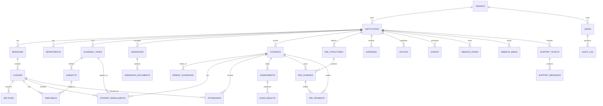

# PostgreSQL Database Design for Education ERP + Website Platform
## Production-Ready Multi-Tenant Architecture

Document Type: Database Architecture Specification
Version: 1.0
Date: 2026-07-06
Prepared For: Product, Engineering, and Platform Teams

---

## 1. Executive Summary
This database design provides a production-ready PostgreSQL foundation for an enterprise-grade Education ERP and Website platform that can be sold as a white-label SaaS to schools, colleges, coaching institutes, computer institutes, and skill development organizations.

The design is built around the following principles:
- Multi-tenant architecture with tenant isolation
- Strong referential integrity through foreign keys and constraints
- Soft delete for safe data recovery and compliance
- Full auditability for finance, academic, admissions, and administration actions
- Scalability for large institutions and high transaction volumes
- Support for multiple schools, branches, campuses, departments, and users

---

## 2. Database Architecture Overview
### Core Design Principles
- Use UUIDs as primary keys for distributed-safe identity management
- Use tenant_id on nearly all business tables to enforce isolation
- Use institution_id and branch_id where operational scope requires it
- Use immutable audit logs for critical business actions
- Use soft delete through deleted_at and deleted_by_user_id
- Use created_at, updated_at, created_by_user_id, updated_by_user_id on all transactional tables
- Use status and version columns for workflow and concurrency control

### Recommended Logical Hierarchy
- Tenant: the customer company or education group
- Institution: one school, college, or institute under a tenant
- Branch: campus or location under an institution
- Department: academic or administrative unit under a branch
- Class: academic class or batch under a department or branch
- Section: subgroup within a class
- User: person accessing the system, such as admin, teacher, student, or parent

---

## 3. Complete ER Diagram

---

## 4. Database Relationships
### Relationship Summary
- One tenant can have many institutions.
- One institution can have many branches, departments, classes, and students.
- One class can have many sections and many student enrollments.
- One student can have one or many parent/guardian records.
- One academic year can manage many enrollments, assessments, and timetable entries.
- One fee structure can contain many fee charges.
- One student can have many fee charges and many payments.
- One institution can publish many notices, events, website pages, and support tickets.
- Every critical business action is recorded in audit logs.

### Cardinality Model
- One-to-Many: most core relationships in the platform
- Many-to-Many: handled through junction tables where required
- Optional relationships: parent linkage, support messages, website media, and document attachments

---

## 5. Normalization Strategy
The database is designed to follow Third Normal Form for operational data while allowing controlled denormalization for reporting and performance.

### Normalization Approach
- Separate master data from transactional data
- Store repeated reference values in lookup or master tables
- Avoid storing derived values in primary transaction tables where possible
- Keep financial history immutable where necessary
- Use reporting tables for aggregated analytics if needed

### Normalization Level
- Core master tables are normalized to eliminate redundancy
- Transactional tables are normalized around business entities
- Denormalized reporting views may be created for dashboards and large reporting queries

### Intentional Exceptions for Performance
- Some summary columns may be denormalized in student, institution, and fee tables for fast dashboard access
- Status names may be stored as codes rather than repeated text
- Search-friendly metadata may be stored in separate indexed columns

---

## 6. Primary Keys
### Recommended Key Strategy
- Use UUID primary keys for all major tables
- Use integer or big integer values only where sequence-based performance is critical and the business does not require globally unique cross-system identifiers
- Use composite unique constraints for business-level uniqueness where needed

### Primary Key Pattern
- id: UUID
- tenant_id: UUID
- institution_id: UUID
- branch_id: UUID
- created_at, updated_at, deleted_at: timestamp with time zone

### Example Unique Business Keys
- tenant_code, institution_code, branch_code, class_code, section_code
- user_email, student_admission_number, staff_employee_code

---

## 7. Foreign Keys and Referential Integrity
All major relationships will use foreign keys to maintain data integrity.

### Referential Integrity Rules
- A student cannot be enrolled in a class that does not belong to the same institution
- A fee payment cannot reference a charge that belongs to another student
- A timetable entry cannot reference a subject outside the institution’s academic structure
- A notice or event cannot be published without a valid institution
- An audit log entry must reference a valid actor user and the affected entity when possible

### Recommended Enforcement Rules
- Restrict deletion of parent master records when dependent child records exist
- Use soft delete on business entities to preserve historical references
- Keep audit and financial records immutable except through controlled correction workflows

---

## 8. Constraints
### Standard Constraints
- Not null on mandatory business fields
- Unique constraints on business identifiers and login identities
- Check constraints for allowed status values and numeric ranges
- Foreign key constraints for all relationships
- Exclusion constraints where range-based overlap must be prevented

### Common Constraint Types
- Status values: active, inactive, suspended, pending, approved, rejected, completed, cancelled
- Numeric ranges: fee amount must be greater than zero, attendance percentage must be between 0 and 100
- Date rules: end_date must be greater than or equal to start_date
- Email and mobile formats must be validated at the application layer and optionally by database constraints where appropriate

### Recommended Business Constraints
- A student cannot be enrolled in more than one active section for the same academic year in the same class stream
- A fee charge cannot be created with a negative amount
- A timetable slot cannot overlap for the same teacher, class, or room without approval
- A support ticket cannot be closed before it has a valid resolution status

---

## 9. Indexing Strategy
### Core Indexes
- Primary key indexes on all primary keys
- Unique indexes on login, code, and business identifier columns
- B-tree indexes on tenant_id, institution_id, branch_id, status, created_at
- Composite indexes for high-frequency queries such as student lookup by institution and class

### Recommended Index Patterns
- users: tenant_id, institution_id, role_id, status, email
- students: tenant_id, institution_id, branch_id, admission_number, class_id, status
- attendance: tenant_id, institution_id, student_id, class_id, attendance_date
- fee_charges: tenant_id, institution_id, student_id, due_date, status
- fee_payments: tenant_id, institution_id, student_id, payment_date, status
- notices: tenant_id, institution_id, published_at, status
- support_tickets: tenant_id, institution_id, status, priority, created_at

### Advanced Indexes for Search and Reporting
- Full-text indexes for notice content, website pages, blog articles, and support ticket content
- GIN or GIST indexes for JSONB metadata if used for flexible fields
- Partial indexes for active records and non-deleted rows

---

## 10. Audit Tables and Audit Strategy
### Audit Design Principle
The system should capture who changed what, when, and from where. Audit trails are mandatory for finance, admissions, academic changes, and administration actions.

### Core Audit Table Structure
- audit_log: high-level event log for all critical actions
- audit_log_detail: detailed field-level change information

### Audit Log Contents
- actor_user_id
- tenant_id
- institution_id
- entity_type
- entity_id
- action_type such as create, update, delete, approve, reject, login, password_reset
- old_value and new_value where relevant
- ip_address and user_agent
- created_at

### Audit Coverage Areas
- User login and permission changes
- Student admission and profile changes
- Fee collection and refunds
- Result and grade edits
- Notice and website content updates
- Support ticket status changes
- Institutional configuration changes

---

## 11. Soft Delete Strategy
All business tables should support soft delete instead of hard delete.

### Soft Delete Fields
- deleted_at: timestamp with time zone
- deleted_by_user_id: UUID
- is_deleted: boolean default false

### Soft Delete Rules
- The application should filter out deleted rows by default
- Deleted records remain available for audit, recovery, and compliance needs
- Hard delete should be limited to internal cleanup, backup rotation, or legal removal processes

### Benefits
- Safer data recovery
- Preserve historical relationships and audit trails
- Prevent accidental loss of student, financial, and institutional records

---

## 12. Tenant ID Strategy for Multi-School Architecture
The platform must support multiple schools or institutions under one platform customer or across many customers.

### Tenant Model
- tenant_id identifies the top-level organization or SaaS customer
- institution_id identifies the school, college, coaching center, or institute
- branch_id identifies the campus or local branch

### Tenant Isolation Rules
- Every tenant-scoped table must include tenant_id
- Queries must always include tenant_id filtering unless explicitly running in global admin mode
- Institution-level data must be isolated from other institutions within the same tenant
- Role-based access must enforce institution and branch scope

### Why This Model Is Production-Ready
- It allows a single SaaS platform to serve multiple schools safely
- It supports group management for franchise, chain, and multi-campus operators
- It allows the platform team to manage upgrades and billing centrally while keeping data isolated

---

## 13. Table-by-Table Design Explanation

### 13.1 Core Multi-Tenant Tables
#### tenants
Purpose: Stores the top-level SaaS customer or education group account.
Key fields: id, name, code, contact_name, contact_email, contact_phone, status, subscription_plan, created_at, updated_at, deleted_at.
Why it exists: This is the top-level isolation boundary for all shared SaaS operations.

#### tenant_settings
Purpose: Stores configuration values for each tenant.
Key fields: tenant_id, branding_name, logo_url, primary_color, secondary_color, timezone, locale, sms_provider, email_provider, payment_provider, enable_white_label, created_at, updated_at.
Why it exists: Supports white-labeling, custom themes, and tenant-specific platform behavior.

#### users
Purpose: Stores all platform users including super admins, institution admins, teachers, students, parents, and support agents.
Key fields: id, tenant_id, institution_id, username, email, password_hash, first_name, last_name, phone, status, last_login_at, created_at, updated_at, deleted_at.
Why it exists: Central identity table for all actors in the platform.

#### roles
Purpose: Stores role definitions such as Super Admin, Admin, Teacher, Student, Parent, Accountant, and Support.
Key fields: id, tenant_id, name, code, description, is_system_role, created_at.
Why it exists: Supports role-based access control across modules.

#### permissions
Purpose: Stores granular capabilities such as view_student, edit_fee, approve_admission, manage_website.
Key fields: id, tenant_id, code, description, module_name, created_at.
Why it exists: Enables fine-grained access rights.

#### user_roles
Purpose: Maps users to roles.
Key fields: id, user_id, role_id, tenant_id, institution_id, assigned_at, assigned_by_user_id.
Why it exists: Allows many-to-many user-to-role assignments.

#### user_permissions
Purpose: Stores direct permission grants when needed beyond role-based access.
Key fields: id, user_id, permission_id, tenant_id, institution_id, granted_at, granted_by_user_id.
Why it exists: Supports exceptional access patterns.

---

### 13.2 Institution and Organization Structure
#### institutions
Purpose: Stores individual schools, colleges, coaching centers, or institutes.
Key fields: id, tenant_id, name, code, type, address, city, state, country, phone, email, website_url, status, created_at, updated_at, deleted_at.
Why it exists: Represents the actual educational entity using the platform.

#### branches
Purpose: Stores campuses or physical locations under an institution.
Key fields: id, tenant_id, institution_id, name, code, address, phone, email, status, created_at, updated_at, deleted_at.
Why it exists: Supports multi-campus and franchise models.

#### departments
Purpose: Stores academic or operational departments such as Science, Commerce, Computer, Arts, or Administration.
Key fields: id, tenant_id, institution_id, branch_id, name, code, head_user_id, status, created_at, updated_at, deleted_at.
Why it exists: Organizes academic structure and reporting.

#### classes
Purpose: Stores class or batch definitions such as Grade 1, BCA 1st Year, or Batch A.
Key fields: id, tenant_id, institution_id, branch_id, department_id, name, code, academic_year_id, status, created_at, updated_at, deleted_at.
Why it exists: Creates the academic grouping structure.

#### sections
Purpose: Stores sections within classes such as A, B, or Morning Batch.
Key fields: id, tenant_id, institution_id, class_id, name, code, capacity, status, created_at, updated_at, deleted_at.
Why it exists: Helps manage class subdivisions and room allocations.

#### academic_years
Purpose: Stores academic sessions such as 2025-2026 or 2026-2027.
Key fields: id, tenant_id, institution_id, name, start_date, end_date, is_active, created_at, updated_at, deleted_at.
Why it exists: Provides scoped academic planning and reporting.

---

### 13.3 Student and Parent Data
#### students
Purpose: Stores core student identity and demographic information.
Key fields: id, tenant_id, institution_id, admission_number, first_name, middle_name, last_name, date_of_birth, gender, blood_group, email, phone, status, created_at, updated_at, deleted_at.
Why it exists: Central record for every enrolled learner.

#### parent_guardians
Purpose: Stores parent or guardian profiles linked to students.
Key fields: id, tenant_id, institution_id, student_id, first_name, last_name, relation, email, phone, occupation, address, status, created_at, updated_at, deleted_at.
Why it exists: Allows family-based communication and fee responsibility tracking.

#### student_enrollments
Purpose: Represents a student’s enrollment in a class, section, and academic year.
Key fields: id, tenant_id, institution_id, student_id, class_id, section_id, academic_year_id, enrollment_date, roll_number, status, created_at, updated_at, deleted_at.
Why it exists: Tracks the academic placement of each learner.

#### student_documents
Purpose: Stores uploaded records such as birth certificate, previous marksheet, transfer certificate, and ID proof.
Key fields: id, tenant_id, institution_id, student_id, document_type, file_name, file_path, mime_type, uploaded_at, status, created_at, updated_at, deleted_at.
Why it exists: Supports admission verification and compliance.

---

### 13.4 Admissions and Enrollment Workflow
#### admissions
Purpose: Stores admission applications before final enrollment.
Key fields: id, tenant_id, institution_id, applicant_name, email, phone, source, program_interest, application_status, submitted_at, reviewed_at, confirmed_at, created_at, updated_at, deleted_at.
Why it exists: Manages the full inquiry-to-enrollment lifecycle.

#### admission_documents
Purpose: Stores uploaded documents related to an admission application.
Key fields: id, tenant_id, institution_id, admission_id, document_type, file_name, storage_path, uploaded_at, status, created_at, updated_at, deleted_at.
Why it exists: Keeps admission paperwork organized and auditable.

#### admission_followups
Purpose: Stores follow-up interactions and communications with admission applicants.
Key fields: id, tenant_id, institution_id, admission_id, followup_date, note, outcome, followup_by_user_id, created_at, updated_at, deleted_at.
Why it exists: Supports admissions teams in managing lead conversion.

---

### 13.5 Academic Operations
#### subjects
Purpose: Stores academic subjects and curriculum units.
Key fields: id, tenant_id, institution_id, department_id, name, code, description, status, created_at, updated_at, deleted_at.
Why it exists: Supports curriculum planning and timetable creation.

#### timetables
Purpose: Stores class schedules and teacher allocations.
Key fields: id, tenant_id, institution_id, class_id, section_id, subject_id, teacher_user_id, day_of_week, start_time, end_time, room_number, academic_year_id, status, created_at, updated_at, deleted_at.
Why it exists: Powers scheduling and classroom operations.

#### attendance
Purpose: Records daily or periodic student attendance.
Key fields: id, tenant_id, institution_id, student_id, class_id, section_id, attendance_date, status, marked_by_user_id, remarks, created_at, updated_at, deleted_at.
Why it exists: Tracks attendance for reporting and compliance.

#### assessments
Purpose: Stores assessments, tests, exams, and assignment events.
Key fields: id, tenant_id, institution_id, class_id, subject_id, assessment_type, title, scheduled_date, total_marks, status, created_at, updated_at, deleted_at.
Why it exists: Supports evaluation workflows.

#### exam_results
Purpose: Stores marks and results for each student within an assessment.
Key fields: id, tenant_id, institution_id, assessment_id, student_id, marks_obtained, grade, remarks, published_at, created_at, updated_at, deleted_at.
Why it exists: Powers reporting, transcripts, and performance tracking.

---

### 13.6 Finance and Billing
#### fee_structures
Purpose: Stores fee categories and rules for an institution.
Key fields: id, tenant_id, institution_id, name, code, academic_year_id, description, status, created_at, updated_at, deleted_at.
Why it exists: Defines fee plans and billing patterns.

#### fee_charges
Purpose: Stores each student’s individual fee obligations.
Key fields: id, tenant_id, institution_id, student_id, fee_structure_id, charge_type, amount, due_date, status, created_at, updated_at, deleted_at.
Why it exists: Tracks outstanding or payable amounts per student.

#### fee_payments
Purpose: Stores payment transactions for fee charges.
Key fields: id, tenant_id, institution_id, student_id, fee_charge_id, payment_reference, payment_mode, amount, payment_date, status, gateway_response_id, created_at, updated_at, deleted_at.
Why it exists: Records actual financial settlements and receipts.

#### payment_reconciliations
Purpose: Stores reconciliation activities between gateway data and internal ledger records.
Key fields: id, tenant_id, institution_id, payment_id, reconciliation_status, reconciled_at, reconciled_by_user_id, remarks, created_at, updated_at, deleted_at.
Why it exists: Supports financial control and audit.

#### expenses
Purpose: Stores institution-level expenses and operational costs.
Key fields: id, tenant_id, institution_id, expense_date, category, description, amount, payment_mode, vendor_name, status, created_at, updated_at, deleted_at.
Why it exists: Supports accounting and reporting.

---

### 13.7 Communication and Website
#### notices
Purpose: Stores official notices, announcements, and circulars.
Key fields: id, tenant_id, institution_id, title, content, published_at, expires_at, visibility_scope, status, created_at, updated_at, deleted_at.
Why it exists: Supports internal and public communication.

#### events
Purpose: Stores academic and institutional events.
Key fields: id, tenant_id, institution_id, title, description, start_at, end_at, location, status, created_at, updated_at, deleted_at.
Why it exists: Helps manage school activities and calendars.

#### website_pages
Purpose: Stores public website pages such as home, about, admissions, contact, and programs.
Key fields: id, tenant_id, institution_id, slug, title, content, page_type, is_published, seo_title, seo_description, created_at, updated_at, deleted_at.
Why it exists: Powers the website experience and white-label branding.

#### website_media
Purpose: Stores images, videos, and downloadable assets for the website.
Key fields: id, tenant_id, institution_id, title, file_name, storage_path, media_type, alt_text, is_published, created_at, updated_at, deleted_at.
Why it exists: Supports galleries, banners, news, and resource pages.

#### contact_enquiries
Purpose: Stores website form submissions and admissions enquiries.
Key fields: id, tenant_id, institution_id, full_name, email, phone, subject, message, source, status, created_at, updated_at, deleted_at.
Why it exists: Connects online visitors to admissions and support channels.

---

### 13.8 Support and Operations
#### support_tickets
Purpose: Stores support requests from staff, students, parents, or administrators.
Key fields: id, tenant_id, institution_id, ticket_number, requested_by_user_id, category, subject, description, priority, status, assigned_to_user_id, created_at, updated_at, deleted_at.
Why it exists: Provides support workflow and service tracking.

#### support_messages
Purpose: Stores messages and updates inside a support ticket thread.
Key fields: id, tenant_id, institution_id, ticket_id, sender_user_id, message, attachment_path, created_at, updated_at, deleted_at.
Why it exists: Keeps support communication structured and auditable.

---

### 13.9 Audit and System Control
#### audit_log
Purpose: Stores immutable or append-only audit events for major actions.
Key fields: id, tenant_id, institution_id, actor_user_id, entity_type, entity_id, action_type, old_value, new_value, ip_address, user_agent, created_at.
Why it exists: Provides forensic traceability and compliance visibility.

#### audit_log_detail
Purpose: Stores field-level change details for complex updates.
Key fields: id, audit_log_id, field_name, old_value, new_value, created_at.
Why it exists: Enables deep change analysis for critical records.

#### system_settings
Purpose: Stores global system-level flags such as maintenance mode, feature toggles, and platform-level defaults.
Key fields: id, tenant_id, key_name, key_value, description, created_at, updated_at, deleted_at.
Why it exists: Supports platform configuration and controlled feature rollout.

---

## 14. Recommended Data Types and Storage Choices
### Primary Identifier Type
- UUID for primary keys across all major tables

### Date and Time Types
- timestamp with time zone for all audit and business event timestamps

### Text and Content Fields
- text for long descriptions and content
- varchar for short business fields and codes

### Binary and File References
- Store file metadata in the database and files in object storage such as S3-compatible storage

### JSONB Usage
- Use JSONB for flexible metadata, custom form values, and configurable workflow fields where necessary

---

## 15. Security Considerations at the Database Layer
- Encrypt sensitive fields where appropriate, especially personal identity and payment-related information
- Use row-level security policies in PostgreSQL where strong multi-tenant isolation is required
- Avoid direct access from application users; use service accounts and least-privilege roles
- Store secrets and system credentials outside the application database
- Restrict admin-level operations to dedicated roles and monitored channels

---

## 16. Scalability Plan for PostgreSQL
### Vertical Scaling
- Use high-memory PostgreSQL instances for the primary database during initial growth

### Horizontal Scaling
- Use read replicas for reporting and analytics workloads
- Partition large tables such as audit_log, attendance, and fee_payments over time if volume becomes significant
- Use connection pooling to handle many simultaneous users

### Partitioning Strategy
- Partition audit_log by month or quarter
- Partition attendance and fee payment tables by year or month for large institutions
- Partition large transaction history tables to preserve performance

### Backup and Recovery
- Daily full backups
- Continuous WAL archiving
- Point-in-time recovery capability
- Test restore procedures for business continuity

---

## 17. Recommended Database Patterns for Production
### 1. Soft Delete Everywhere
All business tables should include deleted_at and deleted_by_user_id.

### 2. Audit Everything Critical
Every admission, payment, academic change, and administrative action should be recorded.

### 3. Tenant-First Query Design
All queries should filter by tenant_id first and by institution_id second where relevant.

### 4. Immutable Financial History
Payment and fee records should not be overwritten; they should be corrected through documented adjustment workflows.

### 5. Workflow Statuses
Use explicit workflow states to keep enrollments, payments, support tickets, and admissions manageable.

### 6. Controlled Denormalization
Approximate reporting data may be stored in summary tables or materialized views for performance.

---

## 18. Suggested Reference Data Tables
These tables help standardize values across the platform:
- countries
- states
- cities
- genders
- blood_groups
- fee_types
- payment_modes
- attendance_statuses
- assessment_types
- ticket_categories
- support_priorities
- document_types
- relation_types

These reference tables should be tenant-aware when values can differ by institution or region.

---

## 19. Final Architectural Recommendation
The database should be implemented as a tenant-aware PostgreSQL platform with:
- UUID-based primary keys
- Strong foreign keys and constraints
- Soft delete for business safety
- Centralized audit logging
- Institution and branch-based scope management
- Scalable indexing and partitioning strategy
- Clear separation of master, transactional, reporting, and audit data

This design is suitable for a white-label SaaS platform that must support many schools, institutions, and users while remaining secure, auditable, and easy to scale.
